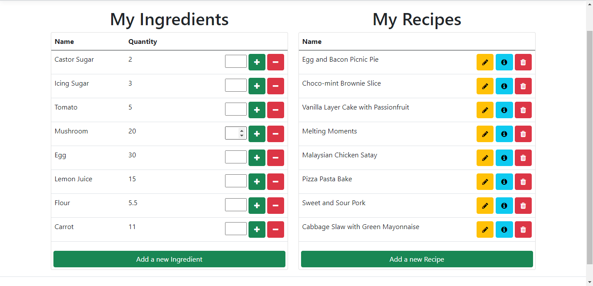

# OnlineFridge

Made By: Darko Bashukoski – 63190358 

Website Link: https://onlinefridge.azurewebsites.net/

API Documentation Link: https://onlinefridge.azurewebsites.net/swagger

Mobile App Repository: https://github.com/DarkoBashukoski/OnlineFridgeApiApp

### 1. Project Overview

For this assignment, I will be creating an application which will help people in the kitchen. It will keep track of their currently available ingredients, provide them with ideas on what kind of food they can make based on their currently available ingredients, and exchange recipes with other users of the application. 

The main part will be the ability to monitor your currently available ingredients. Users will be able to log into their account and enter information regarding what items they have currently and how much of them, add new items to the list, and mark which items they have used so they can be removed from the list. 

Another main feature will be a tool which helps people choose recipes. The tool will look at all currently available ingredients and will provide multiple recipes from which the user can choose from, making sure to provide recipes that only use the available ingredients. After the recipe has been made, the user can confirm that they have made it and the ingredients will be automatically subtracted from their current inventory. 

At the start, the database of recipes will be small, and will not contain many entries. But the app will have a feature which allows users to add their own recipes and share them with other users. With that the database should grow over time as more and more people contribute and expand the number of recipes the app has to offer. 

### 2. Database and Information Storage

As a basis for the project, I created an SQL Database to store all requiered data. Microsoft Azure was used to host the database server. The following is a model of the database used (auto-generated ASP Autorization tables are ommited):

The main table is the **AspNetUsers** table. It contains all information about a certain user including login informaion. 

The next table is the **Recipe** table. It contains all inforation on recipes. It has a many to one relation with **AspNetUsers**, so each user can have multiple recipes. The two tables that support the **Recipe** table are **Step** and **Quantity**. They both work similar to each other. They both have a many to one realationship with **Recipe** allowing the storage of multiple steps and multiple ingredients for each recipe.

The last interesting table is UserIngredient. It acts as the uses inventory and keeps track of which ingredients and how many of each one the user has.

### 3. User Authorization

This website features user authentication. To get the full experience of the site, user will need to create an account an log in. Guest users can only look at the recipe book and browse through the list of recipes. but they cannot add recipes of their own, nor can they keep track of their ingredients. As a loged in user you get access to the **My Profile** page which allows you to add new recipes and ingredients, as well as edit and delete entries you own.

### 4. My Profile Page

After logging in, each user gains access to their own **My Profile** page. It has two sections. The first one is a list of all Ingredients the user has at his disposal.
